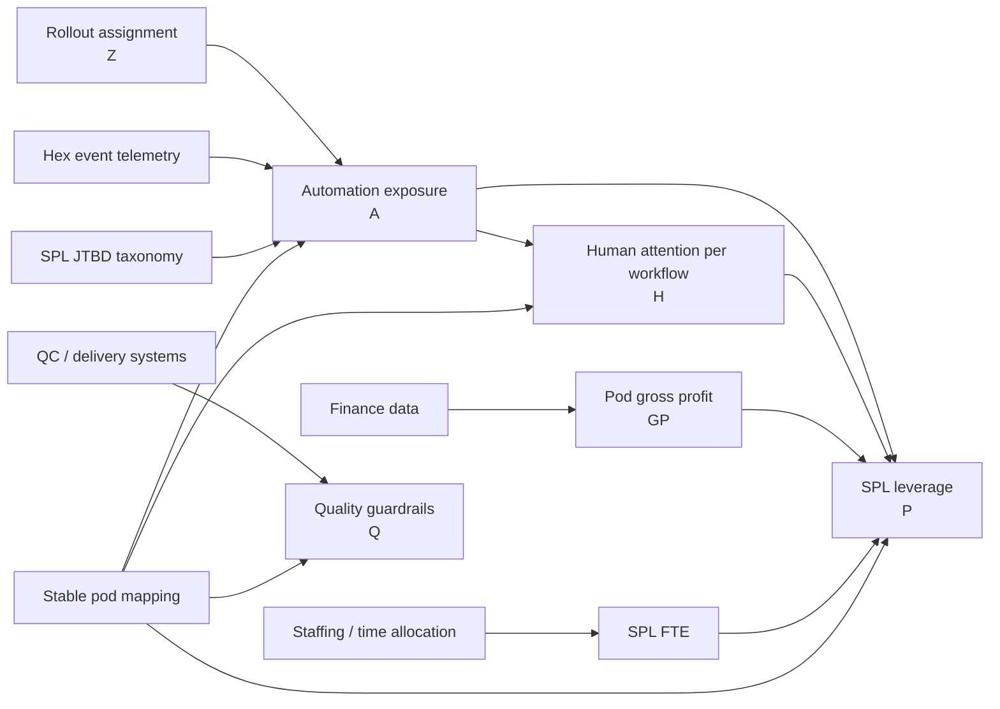

# SPL Automation Economics

Internal scaffold for measuring whether automation makes Strategic Project Leads (SPLs) more productive and whether any operational gains translate into economic value.

This is a research design, not a finalized KPI. It is intended to give economists and engineers a shared map of:

- the causal question;
- every required variable and its source;
- the formulas and why they are constructed that way;
- what exists today versus what requires new instrumentation;
- the minimum viable study and the fuller long-run model.

## Research question

> Does an exogenous increase in SPL automation reduce the human attention required to operate a pod and ultimately increase quality-adjusted economic value supported per SPL?

## The complete causal system



The layers should not be presented as competing methods:

1. **Assignment (`Z`)** — who was offered or enabled for the intervention.
2. **Automation (`A`)** — how much eligible work was actually automated.
3. **Mechanism (`H`)** — whether human attention per workflow declined.
4. **Economic outcome (`P`)** — whether value supported per SPL increased.
5. **Guardrails (`Q`)** — whether quality, delivery, or experience worsened.

## Recommended main metric

The minimum viable economic outcome is pod gross profit per SPL FTE:

```math
P_{pt}=\frac{GP_{pt}}{\mathrm{SPL\ FTE}_{pt}}
```

The primary estimand is the semi-elasticity of this outcome with respect to automation coverage:

```math
\ln(P_{pt})
=
\alpha_p+\lambda_t+\beta\widehat{A}_{pt}+\delta'X_{pt}+\varepsilon_{pt}
```

The headline result for a 10-percentage-point increase in automation is:

```math
\mathrm{Lift}_{10pp}=100\left(e^{0.10\beta}-1\right)\%
```

Plain English:

> A 10-percentage-point increase in automation coverage causes an estimated **X% change in gross profit supported per SPL**, subject to quality and delivery guardrails.

## Why this is only the MVP

The current Hex automation rate is an event-count proxy. It does not yet establish:

- which SPL workflow an event belongs to;
- whether that workflow should be automated;
- how much manual time the event represents;
- whether AI involvement actually displaced human labor.

The ideal automation measure weights mutually exclusive eligible workflows by their pre-treatment manual time:

```math
A_{pt}
=
\frac{\sum_w V_{pwt}M_wS_{pwt}}
{\sum_w V_{pwt}M_w}
```

where `V` is workflow volume, `M` is baseline manual minutes, and `S` is the fraction of labor displaced by automation.

## Minimum viable study

Use a randomized or staggered rollout by pod/project and join:

- cleaned Hex automation telemetry;
- stable SPL-to-pod mapping;
- SPL allocation or hours;
- pod revenue and variable delivery costs;
- existing quality and delivery outcomes.

This avoids blocking the first study on workflow-level time telemetry. Add workflow labeling and attention measurement only after establishing feasibility and signal.

## Repository map

- [`docs/variable-catalog.md`](docs/variable-catalog.md) — complete variable inventory, lineage, status, and proxy relationships.
- [`docs/methodology.md`](docs/methodology.md) — formulas, transformations, denominators, assumptions, and interpretations.
- [`docs/experiment-design.md`](docs/experiment-design.md) — batched rollout, estimands, spillovers, and robustness checks.
- [`docs/engineering-plan.md`](docs/engineering-plan.md) — grains, joins, validation tests, and staged implementation.
- [`docs/presentation-outline.md`](docs/presentation-outline.md) — economist/engineering-facing one-page presentation structure.
- [`docs/notion-equations.md`](docs/notion-equations.md) — copy-ready LaTeX blocks for Notion.
- [`data/variable_catalog.csv`](data/variable_catalog.csv) — machine-readable variable inventory for implementation planning.
- [`diagrams/causal-model.mmd`](diagrams/causal-model.mmd) — editable Mermaid source for the causal diagram.

## Source material

- [Economics SSOT](https://docs.google.com/document/d/16jbeq72m4u3CS1JMkH2qZyb7a8ApT9O0ByHrtbZEnUc/edit)
- [SPL JTBD workbook](https://docs.google.com/spreadsheets/d/1uIXvx8xJy8CgHKKigtqQ2rNHvxBYeXmNlYw7zTmKNO0/edit)
- [Agents metrics Hex dashboard](https://app.hex.tech/500e8e3f-f94b-4ca6-9ba1-d07bdc8e4dfb/app/Agents-metrics-032JAn68Da5VPB4EhoZGLL/latest?tab=agents-overview)
- [Rex / Adina FDE sync](https://notes.granola.ai/t/ad9534c2-a48e-430d-9af0-f25d1a856894-008umkv4)

## Current recommendation

Start with the rollout-instrumented SPL leverage model. Treat the workflow-level production model as a second phase, not a prerequisite. Do not treat the current published Hex automation percentage as a source of truth until its weighting and backfill work are complete.
