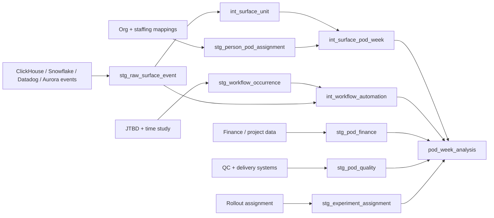

# Engineering data contract and implementation plan

This document translates the research design into datasets engineers can build and economists can audit. The core rule is that every estimate must be reproducible from immutable source events plus effective-dated mappings.

## 1. Canonical grains

| Dataset | One row per | Purpose |
|---|---|---|
| `raw_surface_event` | emitted native or Coil source event | Preserve immutable source telemetry |
| `surface_unit` | canonical query, message, or surface-specific five-minute window | Apply comparable within-surface numerator/denominator logic |
| `workflow_occurrence` | completed SPL workflow unit | Connect usage to an eligible job-to-be-done and its outcome |
| `person_pod_assignment` | person × pod × effective interval | Allocate SPL labor and events without duplicating people |
| `experiment_assignment` | randomized unit × rollout wave | Preserve intention-to-treat assignment |
| `pod_week_finance` | pod × accounting week | Supply revenue and consistently bounded variable cost |
| `pod_week_quality` | pod × week × quality measure | Supply guardrails without collapsing unlike outcomes |
| `pod_week_analysis` | pod × week | Final economic estimation panel |

The MVP needs the assignment, mapping, raw-surface-event, canonical-surface-unit, finance, quality, and analysis tables. `workflow_occurrence` is the richer second phase.

## 2. Minimum viable schemas

### `experiment_assignment`

| Field | Type | Rule |
|---|---|---|
| `randomized_unit_id` | string | Stable pod/project identifier used at assignment |
| `pod_id` | string | Nullable only if project is the randomized unit |
| `project_id` | string | Nullable only if pod is the randomized unit |
| `rollout_wave` | string | Prespecified batch or cohort |
| `assigned_treatment` | boolean | Never replace with realized usage |
| `assignment_at` | timestamp | Frozen assignment time |
| `eligible_at_assignment` | boolean | Defined before outcomes are observed |
| `strata` | object/string | Variables used in randomization |

### `person_pod_assignment`

| Field | Type | Rule |
|---|---|---|
| `person_id` | string | Stable SPL identifier |
| `pod_id` | string | Stable pod identifier |
| `role` | string | Allows explicit SPL filtering |
| `effective_start` | timestamp | Inclusive |
| `effective_end` | timestamp | Exclusive; null only for current assignment |
| `allocation_share` | decimal | Between 0 and 1 |
| `source_system` | string | Staffing, time system, or approved manual map |
| `mapping_version` | string | Reproducibility and backfill tracking |

For a fully allocated SPL and overlapping time interval, allocation shares across pods should sum to 1. Temporary under-allocation may be allowed but must be flagged.

### `raw_surface_event`

| Field | Type | Rule |
|---|---|---|
| `event_id` | string | Unique, immutable identifier |
| `event_at` | timestamp | UTC source time |
| `person_id` | string | Actor responsible for the work |
| `surface` | string | Slack, Google Docs, Snowflake, etc. |
| `tool_name` | string | Canonical tool identifier |
| `source_marker` | string | Native, MCP, queue, OAuth client, etc. |
| `is_bot` | boolean | Bots excluded or reported separately by policy |
| `success` | boolean | Call-level reliability measure |
| `classification_version` | string | Prevent silent historical changes |
| `workflow_occurrence_id` | string | Nullable in MVP; required for workflow model |

### `surface_unit`

| Field | Type | Rule |
|---|---|---|
| `surface_unit_id` | string | Stable key after surface-specific deduplication/sessionization |
| `surface` | string | Snowflake, Sheets, Docs, Slack, Team Platform, or Studio |
| `unit_type` | string | Query, posted message, or five-minute window |
| `unit_start_at` | timestamp | UTC; window floor where applicable |
| `person_id`, `account_id`, `actor_id` | string | Preserve the identities required by the surface definition |
| `numerator_flag` | boolean | Unit satisfies the documented Coil-involvement rule |
| `denominator_flag` | boolean | Unit is in the documented opportunity set |
| `definition_version` | string | Must change when eligibility, deduplication, or markers change |
| `loaded_date` | date | Enables coverage and gap checks |

The precise rules differ by surface and are specified in [`hex-metric-specification.md`](hex-metric-specification.md). A single generic `is_automated` classifier is not enough to reconstruct the saved snapshot.

### `pod_week_finance`

| Field | Type | Rule |
|---|---|---|
| `pod_id` | string | Same canonical ID used by mappings |
| `week_start` | date | Same calendar used throughout the panel |
| `recognized_revenue` | currency decimal | Document recognition convention |
| `non_spl_variable_cost` | currency decimal | Explicit cost boundary |
| `currency` | string | Convert using a versioned FX table if needed |
| `finance_close_version` | string | Supports restatements and auditability |

Do not label `recognized_revenue - non_spl_variable_cost` as official company gross profit unless its cost boundary matches Finance's definition. In this study, the measure excludes SPL labor so labor remains the productivity denominator.

### `pod_week_quality`

Store one row per metric rather than forcing unlike measures into a composite:

| Field | Type | Rule |
|---|---|---|
| `pod_id`, `week_start` | keys | Match analysis panel |
| `metric_name` | string | QC, rework, one-shot acceptance, SLA, NPS, etc. |
| `numerator`, `denominator` | numeric | Preserve counts behind rates when applicable |
| `metric_value` | numeric | Published value |
| `source_system` | string | Lineage |
| `definition_version` | string | Definition stability |

## 3. Source-to-model lineage



### Join order

1. Join each person-level event to `person_pod_assignment` using both `person_id` and the event's effective timestamp.
2. If a person has simultaneous pod allocations, multiply attributed event/time measures by `allocation_share`, unless a direct project/pod tag gives a stronger assignment.
3. Convert raw events to canonical surface units using the exact query/message/window rule for that surface.
4. Aggregate to pod-week only after bot policy, identity matching, deduplication, coverage, definition version, and failures are explicit.
5. Join finance, quality, and rollout tables at their declared pod-week grain.
6. Preserve unmatched records in audit tables; do not silently discard them.

## 4. Metric transformations

Construct one rate for each surface from its canonical units:

```math
A^s_{pt}
=
\frac{\sum_{u\in(s,p,t)}\mathbf{1}(numerator_u=1)}
{\sum_{u\in(s,p,t)}\mathbf{1}(denominator_u=1)}
```

Do not aggregate `N_s` or `D_s` across surfaces. The Snowflake unit is a query, Slack is a message, and the other metrics use surface-specific five-minute windows. Publish six separate rates.

If a single compliance outcome is needed, compute the pre-period standardized index in the analysis layer:

```math
U_{pt}=\frac{1}{|\mathcal S^0_p|}\sum_{s\in\mathcal S^0_p}
\frac{A^s_{pt}-\mu^s_0}{\sigma^s_0}
```

Freeze the relevant surface set and standardization moments before treatment. Label `U` as a baseline-SD adoption index, never an automation percentage.

The pod-week analysis mart should expose the untransformed components as well as the ratio:

- numerator and denominator count for every surface;
- canonical unit type, inclusion/exclusion waterfall, loaded days, and definition version;
- qualifying 4+/7-day active-user count and full-time roster denominator;
- SPL hours and allocation-derived FTE;
- recognized revenue and each included cost component;
- six surface rates, optional standardized adoption index, contribution output, and output per SPL FTE;
- quality numerators and denominators;
- rollout assignment and realized access.

Econometric transforms such as `ln(P)` belong in the analysis layer, not the canonical warehouse mart. This keeps the raw business metric interpretable and makes non-positive values visible.

## 5. Required validation tests

### Identity and range

- `event_id` is unique and non-null.
- effective assignment intervals for a person/pod do not overlap unexpectedly.
- `0 <= allocation_share <= 1` and overlapping shares do not exceed 1 beyond a documented tolerance.
- `0 <= surface_share <= 1` for every surface.
- rate numerators do not exceed denominators.

### Reconciliation

- raw source events reconcile to each surface's canonical units through a documented deduplication/sessionization waterfall.
- saved-snapshot checks reconcile to the published September 2026 `N`, `D`, rate, and loaded-day totals.
- finance components reconcile to the approved finance extract at project and period level.
- pod-week SPL FTE reconciles to the staffing total.
- bot exclusion, failure handling, and each surface's contribution are shown as waterfall counts.

### Experiment integrity

- one immutable assignment per randomized unit;
- no pre-assignment outcomes attributed to treatment;
- treatment/control balance on prespecified baseline covariates;
- missing mappings and missing outcomes reported by treatment arm;
- spillovers and cross-pod SPL assignments flagged.

### Definition stability

- every backfill records source and classifier versions;
- historical values do not change without a versioned restatement;
- all dashboard labels include numerator, denominator, exclusions, grain, and refresh date.

## 6. Staged implementation

### Phase 0 — audit what already exists

- Freeze the saved Hex snapshot and document all six source universes.
- Reconcile Snowflake, Sheets, Docs, Slack, Team Platform, and Studio to their published numerator, denominator, rate, and coverage checks.
- Version bot, failure, scheduling, OAuth, queue-marker, eligible-query, union-window, and roster policies.
- Produce the effective-dated SPL-to-pod mapping.

### Phase 1 — minimum viable causal panel

- Build `experiment_assignment`, `person_pod_assignment`, `surface_unit`, and `pod_week_analysis`.
- Add SPL FTE, finance contribution output, and at least one operational quality guardrail.
- Estimate intention-to-treat first; treat event automation as a secondary mediator.

### Phase 2 — validate the usage proxy

- Compare each surface proxy with short time-use modules and sampled task audits.
- Estimate first stages separately by surface; use the standardized index only as a clearly labeled summary.
- Retain raw telemetry so metrics can be reconstructed after definitions mature.

### Phase 3 — workflow production system

- Define mutually exclusive eligible workflows from the JTBD taxonomy.
- Collect pre-treatment manual minutes and workflow volume.
- Estimate displaced labor share, attention per completed unit, and workflow-level quality.

## 7. Open decisions and owners

| Decision | Proposed owner | Needed before |
|---|---|---|
| Canonical pod/project mapping | RE + data engineering | Phase 1 |
| Six versioned surface numerator/denominator definitions | Hex owner + data engineering | Phase 1 |
| Finance cost boundary and recognition grain | Finance + economist | Phase 1 |
| Randomization unit, waves, and eligibility | Economist + program owner | Rollout |
| Primary quality guardrail | Operations + economist | Analysis plan freeze |
| Workflow taxonomy and baseline minutes | SPL ops + research | Phase 3 |
